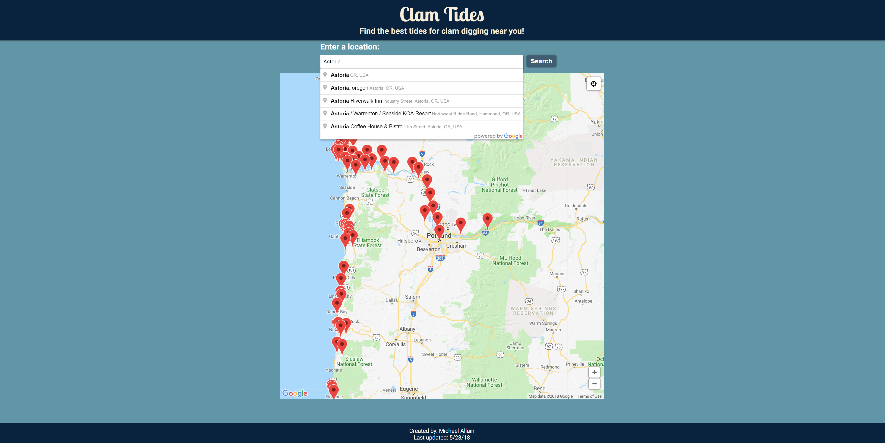
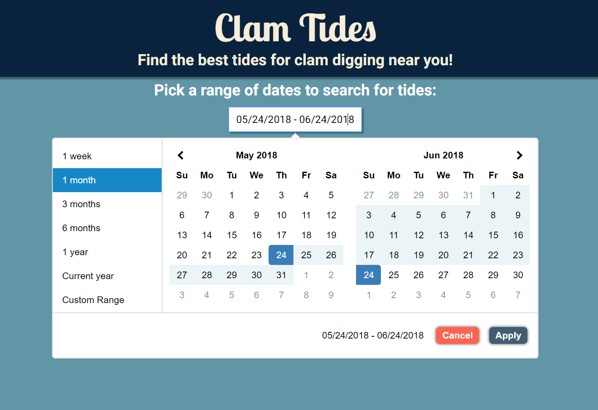
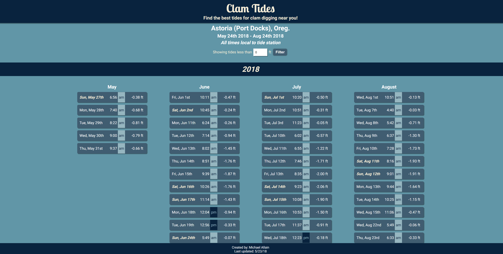

# ClamTides

A tide-finding application for clam diggers. Users can choose tide stations through a location-aware map interface and search for low tides with custom date ranges.

### **_[Live link](https://fastlain.github.io/ClamTides/)_**

## Motivation

When trying to find the best days to dig for clams, it can be surpisingly difficult to find the right tide chart for your location and to sift through the data for low tides. I wanted to make it easy to search for locations, see them on a map, select dates of interest, and to show only the best (lowest) tides.

## Screenshots
#### Home page with map and location autocomplete:

#### Date range selection interface:

#### Tide results:

## Built With

* HTML/CSS/JavaScript

* JavaScript Libraries
    * [jQuery](http://jquery.com/)
    * [Moment.js](https://momentjs.com/)
    * [Date Range Picker](http://www.daterangepicker.com/)

* 3rd Party APIs
    * [Google Maps with Places library](https://developers.google.com/maps/documentation/javascript/tutorial)
    * [NOAA CO-OPS (Tides)](https://tidesandcurrents.noaa.gov/api/)